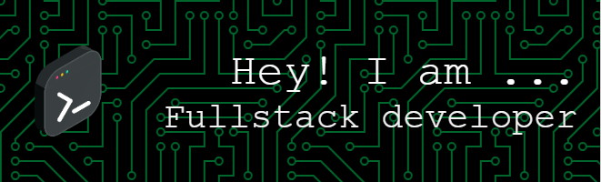

  

 
<h1 align="center">Hi 👋, I'm Ahsan Ali</h1>
 

  <b>Backend enthusiast & Laravel artisan from Pakistan 🇵🇰.</b> I specialize in crafting secure, high-performance APIs and full-stack solutions. While PHP and Laravel are my home turf, I'm equally comfortable building dynamic frontends with <strong>React</strong>, handling real-time data with <strong>Node.js</strong>, or experimenting with concurrency in <strong>Go</strong>. Always learning. Always coding. <strong>💻</strong> 

 

  
  
  
  
  
  
  
  
  
  
  
  
  
  
  
  
  
  
  
  
  
  
  
  
  
  
  

###

  
  
  
  
  

